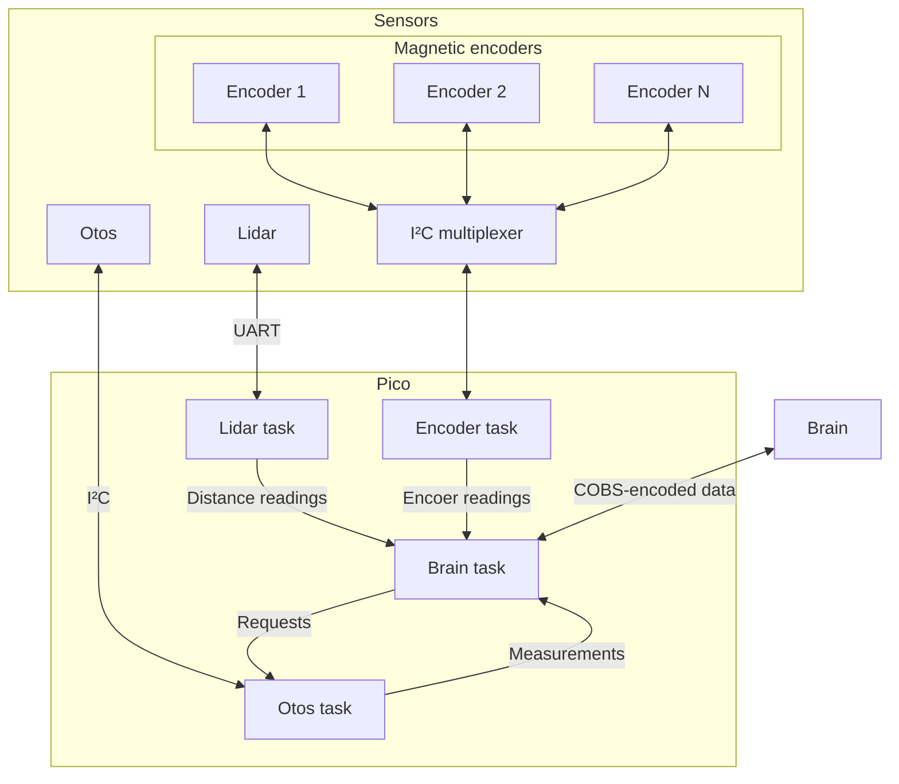

# Pico microcontroller code

## Diagram

```mermaid
flowchart TD
    B[Brain] <-->|COBS-encoded data| BT
    subgraph P[Pico]
        BT[Brain task]
        OT[Otos task]
        LT[Lidar task]
        ET[Encoder task]
        BT -->|Requests| OT
        OT -->|Measurements| BT
        LT -->|Distance readings| BT
        ET -->|Encoer readings| BT
    end

    subgraph S[Sensors]
        O[Otos] <-->|I²C| OT
        L[Lidar] <-->|UART| LT
        subgraph M[Magnetic encoders]
            M1[Encoder 1]
            M2[Encoder 2]
            MN[Encoder N]
        end
        M1 <--> IM
        M2 <--> IM
        MN <--> IM
    end

    IM[I²C multiplexer] <--> ET
```
